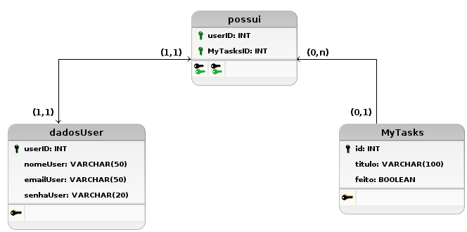

#  WebApp myTasks

Tecnologia em Análise e Desenvolvimento de Sistemas

Setor de Educação Profissional e Tecnológica - SEPT

Universidade Federal do Paraná - UFPR

***

*DS122 - Desenvolvimento de Aplicações Web 1*

## Introdução

***

Atividade final para a disciplina de _Desenvolvimento Web I_ - desenvolvimento de uma aplicação CRUD (Create, Read, Update, Delete) com comunicação com banco de dados, sistema de login, cadastro e sessão

[Vídeo documentação do Projeto](https://www.youtube.com/watch?v=TDKBTakZw4w), disponível no YouTube, para o release atual - versão alpha

> Improtante: Versão Alpha indica o pleno funcionamento das ferramentas essenciais para a conclusão da atividade e obtenção da nota

##  Melhorias futuras

***

Abaixo estão listados requisitos a serem implementados para um melhor funcionamento da aplicação, não implementada na versão inicial por "n" fatores.

- Aprimorar relacionamentos do banco de dados
- Otimizações de Querys SQL
- Refatorar o myTasks (opcional)

##  Esquema do Banco de Dados

***

Modelo lógico do esquema de banco de dados implementado para o projeto.

> Duas entidades (dadosUser e MyTasks), ligadas pelo relacionamento "possui"

Adendo: Alguns atributos foram modificados no decorrer da implementação, como o o campo "senhaUser", que passou de um tipo VARCHAR(20) para VARCHAR(30).

## Como executar a aplicação

***

Para instalar e executar a aplicação no seu localhost, siga os passos abaixo:

1. Altere os dados no arquivo `src/db/db_credentials.php` , usando os dados do seu MySQL/MariaDB
2. Realize o comando: `git clone` do repositório atual
3. Acesse o link `http://localhost/todolist-ds122/src/db/cria_db_tabela.php`
4. A aplicação estará pronta para uso, você pode acessar via: `http://localhost/todolist-ds122/index.php`

> Atenção: alguns pré-requisitos são necessários, o mais indicado para a reprodução é utilizar a stack LAMP ou XAMPP (Linux, Apache2, MySQL, PHP)

## Principais ferramentas

***

As principais ferramentas utilizadas no desenvolvimento da aplicação foram

- Linguagem de Programação: PHP, JavaScript
- Banco de Dados: MySQL
- Frameworks front-end: jQuery, Bootstrap
- Versionamento: git, GitHub

## Colaboradores:

***

Equipe composta por:
- Gabriel
- Izael
- Rafael 

Orientação pelo Prof. Alexander Robert Kutzke